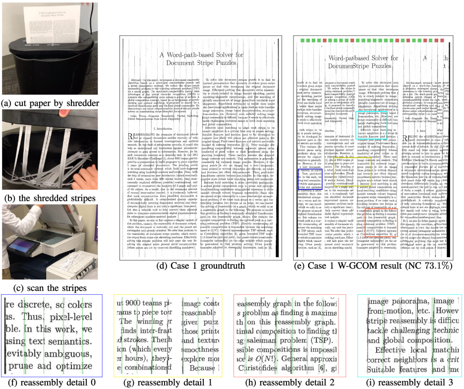
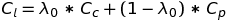

# Reassembling Shredded Document Stripes Using Word-path Metric and Greedy Composition Optimal Matching Solver

This repository is a C++ implementation for TMM 19 paper
> Liang, Yongqing, and Xin Li. "Reassembling Shredded Document Stripes Using Word-path Metric and Greedy Composition Optimal Matching Solver." IEEE Transactions on Multimedia (2019).



If you use these codes in your research, please cite the paper.

**Paper correction:** The Equation (5) should be 


## 1. Environment

We build and evaluate our codes under Ubuntu 18.04 and Mac OS X 10.14.5. The following packages are used in this repository:
1. OpenCV: 3.2.0
2. OpenMP: 2.1.1
3. CMake: 3.5
4. g++: 7.4.0
5. Python: 3.6.8

## 2. DocDataset description

Click [here](http://www.ece.lsu.edu/xinli/DocReassembly/data/DocDataset.zip) to download the `DocDataset`. Unzip the package and copy the `gt` and `stripes` into the `/data/` folder of the repository.

`DocDataset` contains:
1. 60 striped document puzzles with four types of complexities of 20, 30, 40, and 60 stripes. They are named as `doc*_*`.
2. 3 physically shredded document puzzles. They are named as `real*_*`.
3. 1 randomly oriented puzzle named `doc3_36`.

The comparison performance results are reported in the paper Table I, Table II, and Table III.

## 3. Usage

Download this repository, the source code can be compiled into `debug` and `release` executable files. 

### 3.1 Compile

To generate the executable file in the `debug` mode:
```
./autogen debug
```
To generate the executable file in the `release` mode:
```
./autogen release
```

### 3.2 Reassemble a stripe puzzle

A quick example to reassemble the synthesized stripe puzzle
```
./bin/release/solver --text doc0 --num 40 --comp 2 --metric 2 --samples 300
```
Another example to reassemble the real-word stripe puzzle:
```
./bin/release/solver -t real1 -n 27  -c 2 -m 2 -s 10000 -r --word_conf_thres 70 --lambda0 0.5 --lambda1 0.7 --u_a 1 --filter_rate 0.2 --candidate_factor 5
```

The detailed document can be found in 
```
./bin/release/solver --help
```

### 3.3 Run benchmark

We also provide an option to run the whole dataset instead of running each test case individually.
```
./benchmark.sh doc [gen] 
```

When you run the benchmark or add `--benchmark` option to `./bin/release/solver`, the results are saved in `data/scores`.


#### 3.3.1 Generate stripe puzzles
In most cases, we recommend you to use the provided dataset for fair comparison. 

The `gen` provides you an alternative option when running the benchmark. It which will run the `./bin/release/generator` to generate the stripe puzzles from the groundtruth.

Details about randomly generating stripes from groundtruths can be found in `src/generator/generate_puzzle.cpp`.

#### 3.3.2 Recommend parameters
For synthetic data, default parameters are good enough.
```
const double word_conf_thres = 70;
const double lambda0 = 0.3;
const double lambda1 = 0.5;
const double U_a = 2;
const double filter_rate = 0.7;
const int candidate_factor = 4;
``` 
We recommend the `--samples` at least 150, 300, 1000, 8000 for 20-, 30-, 40-, and 60-stripe puzzles.

For real-word data, `real1`, `real2`, and `real3`. We report our results in the following parameters.

```
const double word_conf_thres {70}; // or 60
const double lambda0 = 0.5;
const double lambda1 = 0.7;
const double U_a = 1;

// For Real Case 1
const double filter_rate = 0.2;
const int candidate_factor {5};

// For Real Case 2
const double filter_rate = 0.5;
const int candidate_factor {3};

// For Real Case 3
const double filter_rate = 0.6;
const int candidate_factor {5};
```
We recommend the `--samples` at least larger than 8000.

### 3.4 Clean
```
./autoclean debug
```
or
```
./autoclean release
```

## 4. Reference
```
@article{liang2019reassembling,
  title={Reassembling Shredded Document Stripes Using Word-path Metric and Greedy Composition Optimal Matching Solver},
  author={Liang, Yongqing and Li, Xin},
  journal={IEEE Transactions on Multimedia},
  year={2019},
  publisher={IEEE}
}
```
